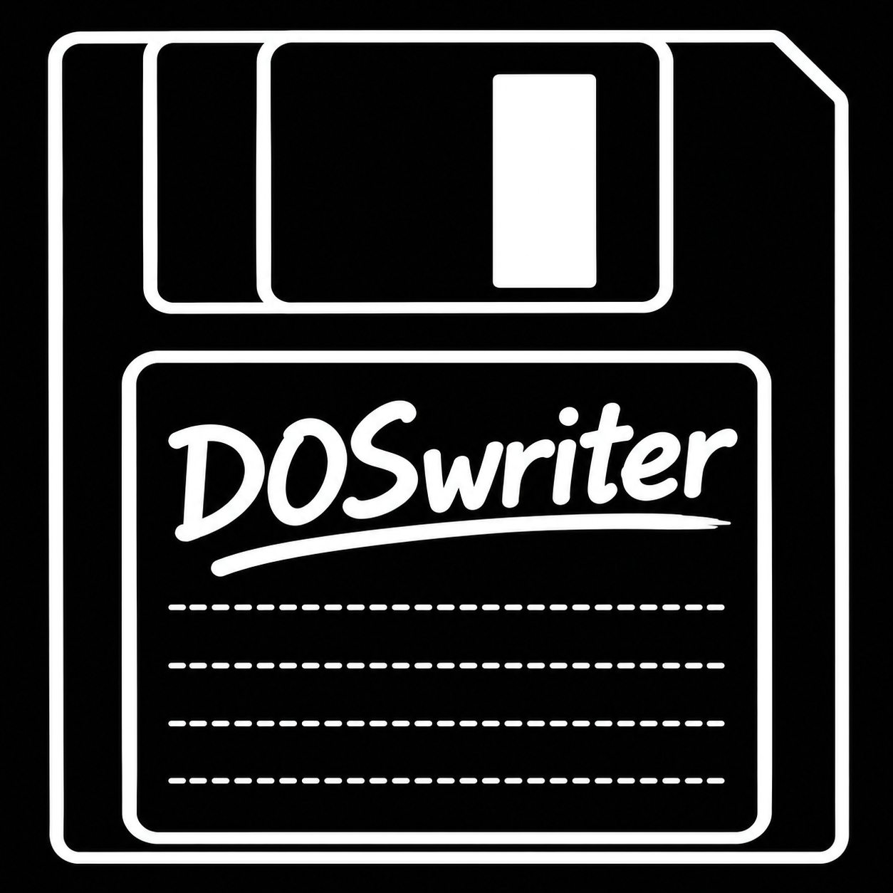
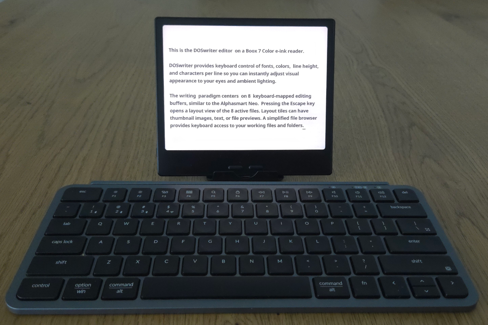
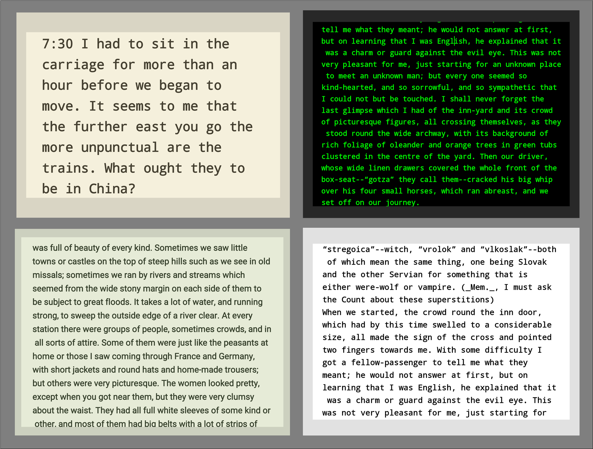
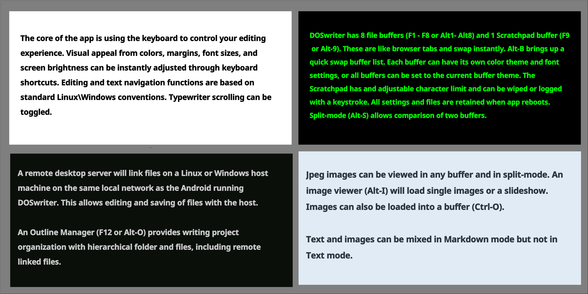
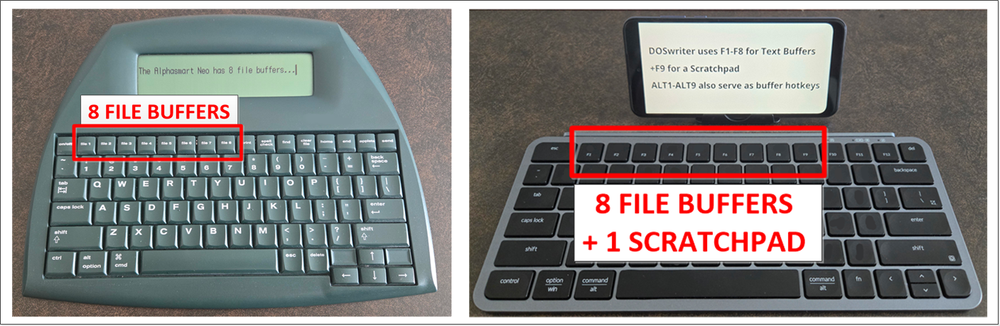
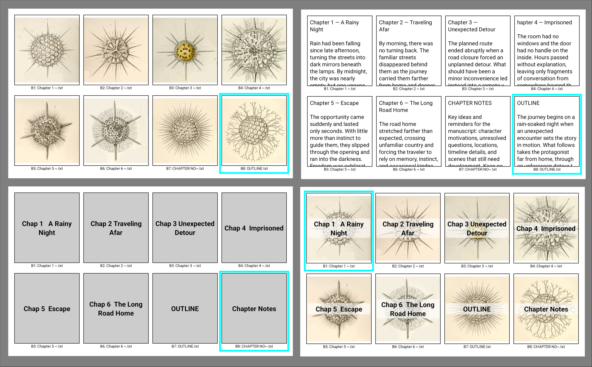
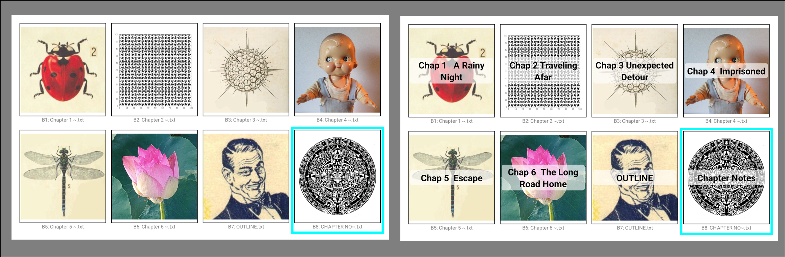
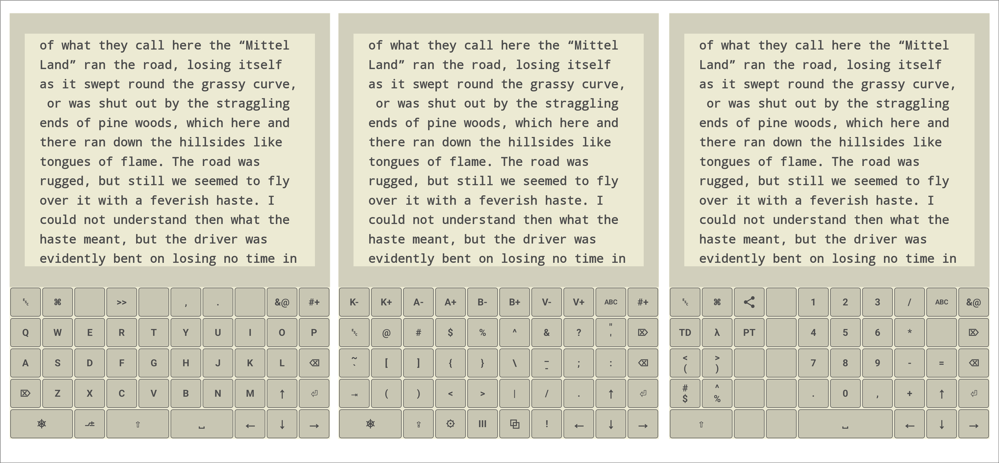

# **DOSwriter**

**A distraction-free, retro-inspired text editor optimized for mobile and E-ink devices.**

**DOSwriter is a minimalist Android writing environment inspired by dedicated writing devices and keyboard-centric workflows such as the Alphasmart Neo and DOS/Unix text editing tools. It is designed for fast, keyboard-driven writing with a focus on stability and simplicity. The keyboard workflow is intuitive and easy to learn. It has tools that address the problem of editing large text files on small phones and e-inks.**

**DOSwriter has good screen control for emulating e-ink displays on backlit devices and has easy ergonomic color settings. It also works on B&W and color Android e-ink displays such as the Boox and the BigMe. Color themes can be set for Day/Night modes. Font size and screen brightness can be adjusted by simple keyboard controls.**

**Other useful features are bookmarks, text collapse, file visualization tools, Markdown editing, an outline manager for project organization, a remote PC file sync tool, Vietnamese TELEX mode, and a virtual keyboard optimized for DOSwriter editing on the go.**

**Use DOSwriter to capture and organize your thoughts on your Android device for later computer formatting with publishing software.**

  
   
  <b>The photo isn't the best. It's difficult to get useful photos of light-emitting devices like the Boox 7.</b>

 
 

  
   
  <b>Screenshots of DOSwriter on Boox 7 Color. Text example is from Frankenstein by Mary Shelley.</b>

 
 

  
   
  <b>Screenshots from Moto G Power (circa 2023). DOSwriter looks good on this device.</b>

 
 

# **Contents**

## [**Motivation**](#Motivation)
## [**Core Concepts**](#Core-Concepts)
## [**Key Features**](#Key-Features)
## [**Getting Started**](#Getting-Started)
## [**Documentation**](#Documentation)

## **1.  Motivation**
DOSwriter is designed for writers who want the simplicity of old-school word processors combined with the power of small Android devices. It features a unique multi-buffer system, keyboard-first navigation, and optimization for Monochrome E-ink displays (like Boox, Supernote, and Bigme).

There is a wide selection of compact, lightweight Bluetooth keyboards, and even heavier mechanical or ergonomic keyboards. Android devices are cheap and ubiquitous. This is an easy combination for a writer deck if the writing software leverages the keyboard interface. The keyboard is where your words are taking shape so optimizing that supports efficient writing production. "Writing production" is a key phrase : If you are trying to write seriously there is the task of managing all the text towards a formatted document for publication.

Desktop and laptop tools are great for formatting and publishing, but that limits your mobility. Writing is more enjoyable away from the machines.

So I wrote DOSwriter. The irony is I spent 3 months hunched over my computer to create it so I would not be hunched over the computer. 

And I could have worked with some of the many fine editors and writing tools available for Android. I tried several out but they just didn't click with me, through no fault of the software. Thus 3 months of tool development vs. a few weeks of "trade-study" with available editors until I had a system that worked for me. Tool development is often a downfall of software projects because it eats up the budget meant for getting the application working.

I think many editor developers wind up on the same path. They try out editors and nothing works so they write their own editor.

DOSwriter is a capture of my writing mental model. I wrote professionally for many years so have some background for attempting such an audacious project. Before writing your own editor (and that is very possible with AI tools now), give DOSwriter a whirl and see how it works or doesn't work for you.

But if you are a fool and insist on developing your own tools, text processing and human interfacing is a fascinating topic of study and you will be richly rewarded for the effort. Nobody will care about your app though. In fact you may get pelted with dung and chased off of internet forums for mentioning it.

If this discussion interests you, I describe the DOSwriter design inspiration and use case on the [DOSwriter website.](https://doswriter.com/usecase/DOSwriterUseCase "DOSwriter Design Inspiration")

## **DOSwriter** **Core Concepts**
DOSwriter is built around simple ideas : A small screen shouldn't force you to think about your writing in a small way, and the device human interface should not pull you out of the mental writing model.

The editor is designed around the way writers actually work: capture text, move between sections, organize a growing manuscript, review the larger structure, work with reference materials, and eventually produce something you can share or print.

Rather than adding conventional desktop-style controls to a small Android screen, DOSwriter uses a keyboard-first workflow built around Text Buffers, Workspaces, and Navigation/Document Visualization Tools.

[1.  Visual Aesthetics and Ergonomic Writing Setup](#Visual-Aesthetics-and-Ergonomic-Writing-Setup)

[2.  Buffers : The Working Text View](#Buffers-The-Working-Text-View)

[2.  Workspaces : The Multi-Buffer Layout View](#Multi-Buffer-Workspace-View)

[4.  The Writing Environment : Stay in the Flow](#The-Writing-Environment-Stay-in-the-Flow)

[5.  Navigating Large Files on Small Screens : Bookmarks & Text Collapse](#Navigating-Bookmarks-Text-Collapse)

[6.  Visualizing Document Structure : Filmstrip & Layout Views](#Visualizing-Filmstrip-Layout)

[7.  Split-Screen Editing and Image Slideshow ](#Split-Screen)

[8.  Using Images and Reference Materials](#Images-Reference)

[9. Managing Writing Projects](#Writing-Project-Management)

[10. Markdown Editing with Live Preview](#Markdown-Editing)

[11. Review & Publication](#Review-Publication)

[12. Desktop File Syncing and Cloud Sharing](#Desktop-File-Syncing)

[13. Built-In Hipster PDA](#Hipster-PDA)

[14. Intuitive Commands and Integrated Help](#Intuitive-Commands-and-Integrated-Help)

[15.  Virtual Keyboard](#Virtual-Keyboard)

### 1.  Visual Aesthetics and Ergonomic Writing Setup

DOSwriter creates a focused writing environment blending retro aesthetics with modern ergonomic controls. The typographic system replaces traditional point sizes with "Characters Per Line" (CPL) presets, using hardware profiling to ensure consistent text density across phones, tablets, and e-ink displays. 

This setup is housed within a high-contrast, theme-aware viewport where users can fine-tune side margins and vertical offsets to create a perfectly balanced writing stage. An ergonomic feature is the Typewriter Mode, which pairs a customizable block cursor with vertical anchoring and visual guide lines to keep the active line centered, significantly reducing eye strain and neck fatigue during long sessions.

DOSwriter provides instant typographic control through dedicated hardware hotkeys, allowing writers to increase or decrease font size on the fly without breaking their creative flow. The engine supports a wide array of high-quality internal and external Unicode TrueType/OpenType fonts, ensuring crisp legibility and complete character support across multiple languages. Whether using a distraction-free Monospace or a sophisticated Serif, the app intelligently maintains layout consistency across all your devices.

Designed for use in any environment, DOSwriter features a robust theme engine optimized for ambient lighting comfort. Users can transition between high-contrast light modes for outdoor use and muted, eye-strain-reducing dark modes for late-night sessions. For E-Ink users, specialized monochrome themes eliminate ghosting and maximize battery life, while integrated Day/Night scheduling automatically shifts the workspace colors based on the local time.

 

  <b>Click for Fonts Demo Youtube video </b>

 

  <b>Click for Color Themes Demo Youtube video </b>

 

  <b>Click for Viewport Margins Demo Youtube video </b>

### 2.  Buffers The Working Text View
At the heart of the application is the keyboard-oriented Working Buffer—a single-instance text view designed for speed and stability. DOSwriter buffers are built to handle large text files without lag, providing a stable "working stage" for your content. 

Buffers are intuitive for working with text. There are 8 buffers corresponding to keyboard F1-F8 keys. Think of the them as a stack of notepads. The 8 DOSwriter buffers map conveniently to keyboard F keys. The Alphasmart Neo uses this paradigm.

The F1-F8 key paradigm adapts well to modern Bluetooth keyboards. Not all keyboards have F keys available so DOSwriter also uses ALT+1-9 keys to swap buffers. 

### 3.  Workspaces : The Multi-Buffer Layout View

The 8 buffer concept works well for file visualization on small devices. DOSwriter has fast buffer layout and preview commands.

The buffer list can be viewed with ALT-B.  Use arrow keys, buffer number, or F keys to select.

 I borrowed an idea from MS Word where you can zoom out and see all your pages in a layout. In DOSwriter all 8 buffers can be viewed at once and selected in Buffer Layout View by pressing `[Esc]` key from any buffer. Use arrow keys/Enter, buffer number, or F key to select. Press `[Esc]` to return to the buffer.   

Workspaces keep related buffers together. Use one for a writing project, another for notes, and another for your ToDo list.
A Workspace contains eight active writing buffers that can be viewed together as a visual layout.

Press `[Esc]` while editing to step back from the text and see the entire Workspace. Each buffer can display text, an image, a file preview, or an image with a text overlay. Buffers can be selected with the keyboard or by touch.

Think of it as a digital corkboard for your writing. Instead of hunting through folders or tabs, your active work is always visible and one keystroke away. This makes the Workspace more than a collection of tabs. See what you're working on before deciding where to go next.

  
   
  <b>Screenshots from Lenovo Tab One showing default Buffer Layout images, text Preview, and Text Overlay.</b>

  
   
  <b>The Layout View thumbnails can be changed with any image. 512x512 px is optimal.</b>

 

  <b>Click for Buffer Layout View Youtube video </b>

### 4.  The Writing Environment : Stay in the Flow

DOSwriter tries to keep routine computer operations from becoming interruptions to writing which helps manage work without leaving the writing environment.

The integrated File Browser provides keyboard-driven access to files and folders without sending the writer into Android's gesture-oriented file picker. You link the root working directory for the File Browser so file operations (Open/Save/Save As) are centered on your working folders, not the sprawling Android file system.

The File Browser also has a minimalist design, presenting only the information you need without screen clutter. As you navigate the files, a preview window displays the image or first page of text, PDF, or Markdown files.

Arrow keys and Enter navigate the file system, while DOSwriter remembers the working directory for each Workspace. Text and image files can also be previewed within the application.

 

  <b>Click for DOSwriter File Manager Youtube video </b>

### 5.  Navigating Large Files on Small Screens : Bookmarks & Text Collapse

Small screens create a particular writing problem: you can concentrate on the current sentence or paragraph, but it is difficult to maintain awareness of a large document. DOSwriter provides tools to navigate that larger structure.

#### Bookmarks
Bookmarks let you mark important locations in a document and return to them instantly. A high-contrast `[BK]` marker and dimmed contextual preview remain visible in the margin, while the Bookmark Menu provides numbered keyboard navigation.
 

  <b>Click for DOSwriter Bookmarks Youtube video </b>

#### Text Collapse
Collapse lets you temporarily hide material that you don't need to see while working—research notes, older drafts, completed sections, or other non-essential material. Blocks can be collapsed manually or by defining patterns such as //NOTES or (DRAFT). A compact preview remains visible so the hidden material is still identifiable. Text Collapse lets users hide completed sections or research notes behind a simple `[+]` icon, decluttering the viewport and allowing the writer to focus purely on the active scene.

Focus on the paragraph you're writing without losing the structure around it.
 

  <b>Click for DOSwriter Text Collapse Youtube video </b>

### 6.  Visualizing Document Structure : Filmstrip & Layout Views
Scrolling through thousands of words on a small device gives you only a tiny window into the document. DOSwriter's Layout and Filmstrip Viewer provide a different way to navigate: reduce the document to a series of visual representations that can be scanned quickly.

The idea came from the same visual principle used by a filmstrip or photographic proof sheet: you can recognize the structure of a large work without reading every word. The DOSwriter analog uses an adjustable page viewing area and paragraph-level previews scanning long documents and jumping directly to a paragraph for editing.

#### Layout View
Displays the document as a grid of miniature pages. Scan the grid, select a page, and return directly to that location in the text.

#### Filmstrip View
This displays the document as a sequence of paragraph-sized views. Configure the amount of text shown and scan rapidly through a long manuscript. Select a section and return directly to that location in the editor.

Filmstrip View is a magnifier for the structure of a document. Both views can also be compiled to PDF, turning the same navigation tools into a way to create condensed reference or proof documents.

 

  <b>Click for DOSwriter Manuscript Viewer Youtube video </b>

### 7.  Split-Screen Editing and Image Slideshow 

Split-Screen Mode allows you to view and edit two buffers simultaneously. This is useful for comparing different chapters of a manuscript, taking notes from a PDF reference, or live-previewing Markdown formatting. Images and image slide shows can also be viewed in one panel while editing in the other.

 

  <b>Click for DOSwriter Split-Screen Mode Youtube video </b>

### 8.  Using Images and Reference Materials

Research, photographs, illustrations, diagrams, and other visual references can be part of the writing process. DOSwriter includes an integrated Image Viewer that can display images full-screen, move through a linked folder, zoom and pan, and run slideshows. Images can also be loaded directly into buffers.

Markdown images can participate in the same workflow, and DOSwriter can use Markdown presentation mode to turn content into a sequence of rendered slides.

PDF documents can be navigated directly from the keyboard, with page navigation, and zoom. Favorites (bookmarks) can be added to the PDF view and exported to a text file.

Reference material can remain part of the Workspace instead of becoming another application to manage. When linked in the Outline Manager they become part of an organized project strcuture.

### 9. Managing Writing Projects
The Outline Manager acts as a hierarchical project hub, enabling you to organize cmanuscripts into custom containers, chapters, and nested folders. By linking individual external files into a cohesive project tree, it facilitates a high-level view of the document structure while providing instant, keyboard-driven navigation between sections. Complementing this, File Preview allows for rapid content verification during the selection process, ensuring the correct draft or research note is identified before loading, thus maintaining a continuous and focused creative state.

### 10. Markdown Editing with Live Preview
DOSwriter supports Markdown editing, Useful for structured formatting without leaving the app. The editor highlights syntax in real-time, while the Live Preview mode (`ALT+R`) renders headers, tables, lists, and images in a clean, professional layout. In split-screen mode, Preview works with the Markdown source code in the left panel with live preview in the right panel. This dual-mode approach allows for high-speed drafting in plain text with the confidence that the final output will be correctly formatted.

### 11. Review & Publication
DOSwriter has basic PDF publishing for buffers and manuscript views. This allows a writer to move between: Write → Navigate → Review → Revise → Publish without abandoning the keyboard-centered environment. 

### 12. Desktop File Syncing and Cloud Sharing
#### Desktop Sync
DOSwriter connects mobile drafting and desktop finishing through a streamlined, local-network sync server. You can wirelessly transmit  active buffers to companion desktop applications such as Notepad++ or VS Code.

I implemented the desktop sync server in the Go language, which works on Linux and Windows, and possibly Apple (did not try it). I have not used the sync tool much but when I have I am surprised how well it works. The server keeps running unless you shut it down, so you can connect from multiple devices at different times. When I finish documenting the app I expect to use this feature more often.

#### Android App Sharing
The app integrates with the Android system provider, allowing for the direct opening and saving of documents to cloud services like Google Drive, OneDrive, or Dropbox without manual file transfers. I have only testd it with Dropbox and Telegram but if your text makes it into the Android share buffer it should work with any app.

### 13. Built-In Hipster PDA
DOSwriter has a secondary 8-buffer Workspace that can be used for personal task management as described in this [DOSwriter link.](https://doswriter.com/instructions/DOSwriterPDA "DOSwriter PDA")

### 14. Intuitive Commands and Integrated Help
Reflecting its keyboard-centric philosophy, DOSwriter minimizes menu-diving through a comprehensive system of intuitive `CTRL` and `ALT` command chords. For users needing a quick reference, the Integrated Help system provides searchable, Markdown-based documentation that can be summoned instantly with `CTRL+H`. This ensures that every tool—from advanced search and replace to hardware-specific settings—is always accessible at your fingertips.

### 15.  Virtual Keyboard
For devices without physical hardware, the DOSwriter Virtual Keyboard offers a tailored input experience optimized for retro writing. Beyond standard alpha-numeric keys, it includes specialized layouts for navigation and secondary symbols, along with a unique **CTRL Lock** feature for modifier-heavy operations. This design ensures that the app remains a powerful, distraction-free writing tool on any touch-screen device.

  
   
  <b>When a keyboard is not connected, DOSwriter has a dedicated 3-screen Virtual Keyboard. Key functions are described in ALT-H>Virtual Keyboard Map</b>

 
 

## **Key Features**
- **Distraction-Free Editing**: The default visual mode is fullscreen with no icon clutter or Android distractions. 
- **Text-Only**: DOSwriter uses Unicode text fonts which are portable between all writing applications and operating systems.
- **Multi-Buffer Workspace**: Instant hotkey access to 8 active documents. 
- **Instant Workspace Viewing**   Use `Esc` to view a visual layout of all buffers with persistent thumbnails.
- **Scratchpad**: A dedicated 9th buffer for quick notes with auto-flushing to a permanent log file.
- **Visual Aesthetics**: Hotkey adjustable ergonomic color themes, fonts, margins, screen brightness.
- **Splitscreen Mode**: Splitscreen view and editing of multiple buffers or images.
- **Text Processing**: Macros, Bookmarks, and Text Collapse
- **Writing Visualization**: Tools for working with large text files on small devices.
- **Typewriter Mode**: Typewriter editing and scrolling with demo mode.
- **File Manager**: Keyboard-centric File Browser and file operations centered on your working folders.
- **Outline Manager**: Link work files in project trees with preview selection.
- **Markdown & PDF Support**: Full Markdown rendering (including tables) and PDF compilation.
- **Desktop Sync**: Real-time synchronization with a desktop host via network socket for seamless "mobile-to-PC" workflows.
- **E-Ink Optimized**: High-contrast UI elements, custom `[+]` Fold and `[BK]` Bookmark icons, and integrated hardware drivers for Onyx/Boox and Supernote.
- **Scripting Engine**: Automate repetitive tasks or create custom presentation modes with a built-in command script language.

# **Getting Started**
1. **Installation**: Deploy the APK to your Android device (Min SDK 23).
2. **Permissions**: Grant storage permissions to enable file opening and saving.
3. **Linking Folders**: Go to `ALT-S (SETTINGS) > File Manager` to link your primary writing folder.
4. **Learn the Keys**: DOSwriter is built for hardware keyboards but includes a powerful virtual layout. Press `ALT-H` anytime for the help system.

## **App Operation**

### **App Integration & Workflow**
- **Direct Entry**: Launches immediately into a keyboard-focused file editor. No splash screen delays (Help popups can be turned off in Settings).
- **Hotkeys**: Standardized shortcuts for all operations. Use `CTRL-ALT-X` to exit or `ALT-X` to quickly minimize the app.
- **Sharing**: Integrated Android sharing system allows you to send buffer content to other apps instantly.

### **The Multi-Buffer Paradigm**
- **Leverages Keyboard Layouts**: Uses `F1-F8` or `Alt1-Alt8` like a stack of notepads for instant access.
- **8+1 System**: Work on 8 standard documents plus a dedicated 9th **Scratchpad** `F9`.
- **Buffer Layout (`Esc`)**: A bird's-eye view of your entire workspace with persistent thumbnails and live file info. Supports finger-tap selection.
- **Split-Screen**: View two buffers at once (Vertical or Horizontal) or compare two sections of the same file.
- **Buffer Status**: `CTRL-H` hides or shows current buffer filename and details .

### **Text Navigation**
- **Keyboard Centric**: Designed for hardware keyboards with standard and power-user shortcuts.
- **Precision Movement**: 
  - **Arrows**: Character and visual line movement.
  - **CTRL + Arrows**: Word and paragraph jumps for rapid traversal.
  - **ALT + Arrows**: Sentence jumps or jumping to visual line start/end.
- **Selection**: Hold `SHIFT` with any navigation key to select text blocks. Supports system-wide and internal clipboard management.

### **Multiple Workspaces**
- **Default Mode**: Your primary environment for creative writing.
- **To-Do Mode**: Switch to a dedicated 8-buffer workspace via `ALT-W` designed for task tracking and project management.

### **Viewport & Typography Control**
- **Precision Font Control**: Adjust font size with `CTRL-` and `CTRL+`, and line height with `CTRL-L`
- **Margins**: Set custom side and top/bottom margins to create the perfect writing focus area.
- **Vertical Offset**: Shift the entire text block vertically to center your work on your device's unique screen or case.

### **Visual Themes & Brightness**
- **E-Ink Specific Color Themes**: High-contrast modes like "Classic", "E-Ink", and "CRT" designed for maximum legibility.
- **Day/Night Mode**: Automatic theme switching based on your local time.
- **Brightness Control**: Adjust system brightness directly from the app using `ALT-` and `ALT-+`.
- **Cycle Themes**: Cycle forward and back through available Themes with `CTRL-T` and `CTRL-ALT-T`
- **Display Themes**: Displays current Theme name `CTRL-SHIFT-T`
- **Custom Themes**: Define custom color themes using RGB values in Settings>Theme

### **Editing Modes**
- **Plain Text**: Efficient editing for standard `.txt` files with full support for power tools like folds and bookmarks.
- **Typewriter Mode**: Keep your focus point centered. Features include "Stationary Cursor" (platen moves) or "Moving Cursor" modes.
- **Markdown Support**: Dedicated rendering engine for `.md` files. Toggle live preview with `ALT-R`.
- **Split-Screen Rendering**: A unique side-by-side workflow. Edit Markdown source in one buffer while the second buffer displays the live rendered output (automatic for `.md` files).

### **Publishing**
- **PDF Compilation**: Export your work in Standard A4, Manuscript WYSWYG, or a unique 8-in-1 Landscape "Mini-Book" format.
- **Markdown Rendering**: Full live preview of Markdown files including tables and images.

### **Text Viewing & Manuscript Management**
- **Filmstrip Viewer**: View your document as a series of individual pages for easy proofreading.
- **Layout Grid**: A 4 or 8-page "light table" view to see the flow and structure of your manuscript.

### **Cursor & Typewriter Control**
- **Custom Styles**: Choose between Block, Thin/Thick Caret, Underline, and Retro styles.
- **Locator**: A special high-speed blink to help you find your cursor in large documents.

### **File Management & Supported Types**
- **Supported Files**: Seamlessly handles `.txt`, `.md` (Markdown), `.pdf`, `.jpg`, `.png`, and `.gif` files.
- **Dual Browsers**: Toggle between the standard **Android System Browser** and the custom, keyboard-optimized **DOSwriter File Browser**.
- **Images**: Link local folders for background reference images or use the built-in **Slideshow Viewer**.

### **Virtual Keyboard**
- **Custom Layouts**: Optimized Alpha, Punctuation, and Numeric layers.
- **CTRL Lock**: A virtual "Sticky Key" (`⎈L`) that allows you to perform complex chords and navigation with single taps.
- **Telex Support**: Integrated Vietnamese TELEX input mode.

### **Power Tools**
- **Outline Manager**: Organize large projects (`CTRL-ALT-O`). Link multiple local or remote files into folder hierarchies with preview.
- **Macros**: Use `CTRL-ALT-M` for the macro console or `CTRL-ALT->>` to define quick snippets.
- **Text Collapse**: Collapse paragraphs with `CTRL-J` to focus on specific sections. Features a high-contrast `[+]` marker with text preview.
- **Scripting Engine**: Automate repetitive tasks or create custom presentation modes with a built-in command script language.

# **Documentation**
- [Function & Keyboard Map](./DOSwriter-Function-Keyboard-Map.md)
- [Menus & Settings](./DOSwriter-Menus-Settings.md)
- [DOSwriter File Manager](./DOSwriter-File-Manager.md)
- [Fonts](./DOSwriter-Fonts.md)
- [Image, Markdown, & PDF](./DOSwriter-ImageMdPDF-Commands.md)
- [Text Tools](./DOSwriter-Text-Tools.md)
- [Text Macros](./DOSwriter-Text-Macros.md)
- [Remote Desktop Sync](./DOSwriter-Remote-Sync.md)
- [Virtual Keyboard](./DOSwriter-Virtual-Keyboard )
- [Vietnamese TELEX](./Vietnamese_TELEX_Test_Guide.md)

---

## License
Copyright © 2026. All rights reserved.

---
[Back to Top](#doswriter)
